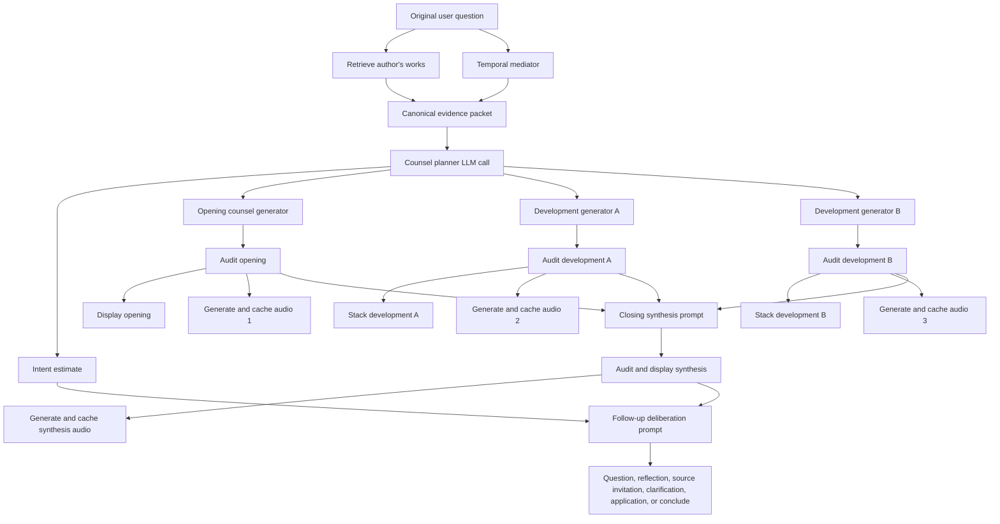

# Context-Faithful Staged Author Response Execution Plan

**Status:** urgent planned execution

**Roadmap target:** `v1.3.6S`

**Requested:** 2026-07-14

**Owner surfaces:** AugustineCorpus, AugustineService, AugustineFE, Fortress
Phronesis documentation, and PericopeAI response governance

**Runtime posture:** additive, feature-gated, and backward compatible with the
existing `POST /api/v2/chat` JSON contract

**Deployment note:** This plan changes the planned prompt orchestration,
response data flow, persistence shape, and text-to-speech scheduling. It does
not authorize a deployment by itself. Runtime promotion must use the existing
Fortress Phronesis deployment runway and update architecture, migrations,
configuration, smoke checks, and rollback coverage in the same change.

## Purpose

PericopeAI author responses currently arrive as long monolithic speeches. The
frontend renders one answer string, and Speak divides that string into
character-bounded technical chunks after the user requests playback. That
shape obscures the natural movement of thought, delays useful audio, and makes
the author sound like a general-purpose assistant delivering an essay.

This plan replaces that interaction with a source-grounded counsel pipeline:

1. understand the author in the author's historical, geographic, linguistic,
   rhetorical, and intellectual context;
2. retrieve the author's works before any user-facing answer is generated;
3. mediate only the minimum unfamiliar facts needed for an author to understand
   an interlocutor from another time and land;
4. use an internal structural LLM prompt to organize the response and bind each
   planned thought to evidence;
5. generate connected author-response segments one at a time;
6. display the segments as one growing counsel stack;
7. generate and cache speech for completed segments while later text is still
   being generated;
8. generate the closing synthesis from the actual completed segments; and
9. select the next conversational move from the original user intent and what
   the author actually said.

The governing hermeneutic is:

> Understanding precedes application. Recover the author within the author's
> own horizon before bringing that thought into the user's horizon.

## Product Outcome

A user receives one coherent author turn that grows through connected movements:

1. historical ground when the question requires it;
2. opening counsel;
3. one or more developing thoughts;
4. bounded application only after the author's meaning is established;
5. a final author synthesis; and
6. the most appropriate next conversational move, which may be a question,
   source invitation, clarification, reflection, application prompt, or a
   decision to conclude.

The first segment becomes visible and eligible for speech before the entire
response is complete. The author does not produce a generic acknowledgement
while retrieval or planning continues.

## Non-Negotiable Product Principles

### 1. The opening is the author's answer

The opening segment is not a generic LLM preamble. It must be generated only
after author-work retrieval and structural planning. It must speak from the
selected author's works, vocabulary, voice, and historical horizon.

Disallowed openings include:

- "That is a great question."
- "I understand how you feel."
- a generic summary produced before retrieval completes;
- a modern assistant answer later decorated with an author quotation; and
- an ungrounded answer emitted while the corpus is still loading.

### 2. The works precede the answer

No user-facing author segment may be released until the canonical evidence
packet is assembled. The packet must contain source IDs, passages, work and
location metadata, retrieval provenance, and any explicit reader-selected
source context.

### 3. Historical understanding precedes modern application

The planner must first recover:

- the problem the author was addressing;
- the meaning of load-bearing terms in the source context;
- the original audience and genre;
- the author's intellectual, religious, political, and social setting;
- the chronology of the work within the author's life when relevant; and
- the limits of what may be attributed to the author.

Only a later segment may construct a bounded application to the user's world.
The application must be labeled internally as application or analogy rather
than silently represented as an attested historical claim.

### 4. The mediator mediates only

The temporal mediator preserves the original question and supplies only the
literal orientation necessary for comprehension across time and place.

The mediator may:

- preserve the user's words verbatim;
- identify a term, object, institution, or mechanism outside the author's
  historical horizon;
- provide a concise factual description of what that unfamiliar referent is or
  does;
- identify information explicitly supplied by the user as user testimony; and
- tell the author that the interlocutor comes from another time and land.

The mediator may not:

- answer the question;
- decide the moral, emotional, political, or social meaning of the situation;
- diagnose the user;
- replace the user's account with a supposedly deeper issue;
- choose the author's conclusion;
- modernize the author's vocabulary; or
- simplify the exchange for an assumed mass audience.

Intent interpretation is a separate operation. It may help organize the
response or choose a follow-up, but it must not rewrite the question or become
an asserted fact about the user.

### 5. Preserve lexical meaning

PericopeAI must preserve historically and conceptually load-bearing words.
Explanation is additive; simplification must not replace the term.

Examples:

- `meek` must not become `weak`, `nice`, `passive`, or `harmless`;
- `virtue`, `charity`, `passion`, `soul`, `will`, `appetite`, `grace`, `honor`,
  `fate`, and `household` must not be flattened into contemporary lifestyle or
  therapeutic vocabulary;
- user-supplied modern words remain present as user testimony, even when the
  author receives a minimal explanatory gloss; and
- a selected translation may explain a term's semantic range without silently
  replacing it.

The interpretation that meekness concerns governed or judicious power may be
explained when supported by the selected lexical and interpretive sources, but
the response must preserve `meek` and distinguish lexical evidence from later
interpretive explanation.

### 6. Historical forms of address carry relationships

`Thou` and `thee` are not decorative archaisms. They are subject and object
forms of the singular pronoun family. The wider choice between
`thou/thee/thy/thine` and `ye/you/your` may encode number, familiarity,
formality, intimacy, contempt, solidarity, hierarchy, or asymmetric authority.

The response system must therefore use a reviewed address profile rather than
an `old_sounding=true` style switch. It must model:

- singular versus plural address;
- subject, object, and possessive case;
- reciprocal or asymmetric address;
- the author's office and the interlocutor's role;
- genre and translation tradition;
- changes in relationship during a conversation; and
- evidence from the author's works or the selected translation corpus.

For authors who wrote in Latin, Greek, Hebrew, or another language, use of
Early Modern English forms is a translation decision, not a claim about the
literal language spoken by the author. Once a translation register is chosen,
its grammatical and relational distinctions must be used meaningfully.

### 7. The system may bridge time without moving the author into the present

The author may accept user testimony about an unfamiliar object or institution.
Accepting testimony does not grant the author general modern knowledge.

For example, the mediator may explain a modern messaging system as:

> A means by which people in distant places exchange written messages with
> almost no delay, sometimes through an instrument the user carries.

The mediator must not tell the author what the situation ultimately means. The
author determines its relevance from the author's own conceptual vocabulary
and works.

### 8. Follow-up is not engagement bait

The follow-up deliberator chooses the most appropriate next conversational
move. `conclude` is a valid result. The system must not manufacture a question
merely to increase interaction counts.

## Current-State Gap

The deployed chat path currently:

1. retrieves corpus context;
2. performs one answer-generation call;
3. stores one answer string;
4. produces a locally compacted summary;
5. derives an optional follow-up; and
6. returns an `answer` segment plus citations, summary, follow-up, and books.

The frontend extracts `answer.payload.answer`, stores it as one assistant
message, and renders one Speak control. Long speech is then divided by sentence
and character limits. Those are delivery chunks, not meaningful units of
thought.

The target design must preserve the legacy complete answer while adding
semantic counsel segments and independent text/audio readiness.

## Terminology

| Term | Meaning |
| --- | --- |
| Historical horizon | The dated, geographic, linguistic, social, and intellectual boundary within which the author may reason. |
| Author knowledge envelope | Versioned policy defining allowed works, documented exposure, plausible contemporary context, knowledge cutoff, and excluded later knowledge. |
| Temporal mediator | Minimal cross-time glossary and orientation layer; it does not interpret or answer. |
| User testimony | Facts or experiences stated by the user that the author may accept without gaining general modern knowledge. |
| Intent interpreter | Internal estimate of what the user seeks; kept separate from mediation and treated as uncertain. |
| Counsel planner | Hidden LLM call that organizes the response and binds planned claims to sources. |
| Counsel segment | One connected, source-grounded movement in the author's response. |
| Technical TTS chunk | Engine-sized audio subdivision of a counsel segment; never presented as a semantic unit. |
| Closing synthesis | Final author-grounded prompt over the actual completed counsel segments. |
| Follow-up deliberator | Final prompt that chooses the appropriate conversational continuation or conclusion. |
| Anachronism auditor | One-way validation layer that may detect later knowledge but may not inject it into author prose. |

## Target Orchestration



## Canonical Author Context Packet

All author-facing generation calls must receive the same immutable packet ID.
Individual generators may receive a bounded subset of passages, but the subset
must be derived from and traceable to that packet.

```json
{
  "context_packet_id": "ctx-123",
  "author_slug": "augustine",
  "author_profile_version": "...",
  "knowledge_envelope_version": "...",
  "translation_profile_version": "...",
  "address_profile_version": "...",
  "knowledge_cutoff": "0430-08-28",
  "original_question": "...",
  "user_testimony": [],
  "temporal_glosses": [],
  "conversation_state": {},
  "selected_source_context": null,
  "retrieved_passages": [
    {
      "passage_id": "...",
      "work": "...",
      "location": "...",
      "text": "...",
      "provenance": "retrieved",
      "historical_date": "...",
      "review_status": "approved"
    }
  ],
  "protected_terms": [],
  "historical_context_claims": []
}
```

### Author knowledge envelope

The first implementation should support:

```json
{
  "author_slug": "augustine",
  "knowledge_cutoff": "0430-08-28",
  "active_period": {"start": 354, "end": 430},
  "documented_regions": [],
  "documented_travel": [],
  "languages": [],
  "institutions_and_networks": [],
  "direct_works": [],
  "documented_exposure": [],
  "plausible_contemporary_context": [],
  "excluded_later_knowledge": [],
  "default_modern_context_policy": "minimal_mediation"
}
```

Geographic isolation must not be reduced to physical distance. Plausible
knowledge also depends on travel, correspondence, trade routes, political and
religious networks, language, translation availability, office, education,
social position, and documented access to texts.

### Knowledge-basis statuses

Each claim or segment must distinguish:

- `directly_attested`
- `historically_contextualized`
- `authorial_synthesis`
- `plausible_period_context`
- `user_testimony`
- `mediated_referent`
- `bounded_application`
- `counterfactual`
- `insufficient_evidence`

## Stage 1: Temporal Mediation

Temporal mediation should be deterministic when a reviewed glossary entry
exists. An LLM may propose a missing gloss, but it must not silently promote
that proposal into the author packet without validation.

Example:

```json
{
  "original_text": "Should I mute Slack after work?",
  "glosses": [
    {
      "term": "Slack",
      "literal_description": "A means of exchanging written messages over distance with almost no delay.",
      "basis": "reviewed_temporal_glossary"
    },
    {
      "term": "mute",
      "literal_description": "To prevent the instrument from announcing that a message has arrived.",
      "basis": "reviewed_temporal_glossary"
    }
  ]
}
```

Do not add inferred effects, diagnoses, social analysis, or moral framing to
this record.

## Stage 2: Intent Interpretation And Counsel Planning

The structural prompt is a required hidden LLM call. It receives the complete
evidence packet and returns a compact plan, not polished author prose.

The planner must:

- estimate the user's conversational intent and confidence;
- identify whether clarification is required before counsel;
- recover relevant historical and lexical context;
- define a central thesis supported by the works;
- define two to five connected speech movements;
- bind every planned substantive movement to passage IDs or an explicit
  knowledge-basis status;
- identify protected words and address choices;
- identify where historical understanding ends and application begins;
- reserve the final conclusion for the closing synthesis call; and
- state unresolved questions without manufacturing an engagement prompt.

Example planner output:

```json
{
  "plan_id": "plan-123",
  "context_packet_id": "ctx-123",
  "intent": {
    "primary": "decision_support",
    "secondary": "source_interpretation",
    "confidence": 0.74,
    "uncertainty": "The consequence the user most fears is not stated."
  },
  "central_thesis": "...",
  "historical_ground": "...",
  "protected_terms": ["meek"],
  "address_policy": {
    "family": "thou_thee",
    "number": "singular",
    "relationship": "...",
    "evidence": ["..."]
  },
  "segments": [
    {
      "sequence": 1,
      "kind": "opening_counsel",
      "purpose": "Answer directly from the author's works.",
      "claim": "...",
      "source_ids": ["..."],
      "target_words": 55,
      "depends_on": []
    },
    {
      "sequence": 2,
      "kind": "historical_development",
      "purpose": "Recover the author's own conceptual distinction.",
      "claim": "...",
      "source_ids": ["..."],
      "target_words": 80,
      "depends_on": [1]
    },
    {
      "sequence": 3,
      "kind": "bounded_application",
      "purpose": "Bring the recovered principle to the user's matter without claiming direct historical knowledge.",
      "source_ids": ["..."],
      "target_words": 70,
      "depends_on": [1, 2]
    }
  ],
  "closing_goal": "...",
  "follow_up_candidates": []
}
```

The initial vertical slice may combine intent estimation and counsel planning in
one call. Keep their output fields separate so a later implementation may split
or independently evaluate them.

## Stage 3: Connected Segment Generation

### Response rhythm

Recommended defaults:

| Movement | Typical length | Purpose |
| --- | ---: | --- |
| Opening counsel | 25-60 words | Direct author-grounded response without generic preamble. |
| Historical or conceptual development | 40-90 words | Explain one source-supported distinction in the author's own horizon. |
| Additional development | 40-90 words | Add source, qualification, tension, or reasoning without repeating. |
| Bounded application | 30-80 words | Apply only after meaning is recovered; label the bridge internally. |
| Closing synthesis | 25-70 words | Unify what was actually said; introduce no new major argument. |
| Follow-up | 8-30 words | Choose the next appropriate conversational move or conclude. |

Short questions may use opening, closing, and follow-up only. Complex questions
may use two or three development segments. Do not force a fixed number when the
works support a concise answer.

### Generator contract

Each segment generator receives:

- the immutable context packet ID;
- the full structural plan;
- its assigned movement;
- its allowed source passages;
- the actual text of prerequisite segments when available;
- protected lexical and address constraints;
- the planned next movement so it can connect without concluding early; and
- explicit instructions not to write as a modern assistant.

Each generator returns:

```json
{
  "segment_id": "resp-123:2",
  "sequence": 2,
  "kind": "historical_development",
  "text": "...",
  "speech_text": "...",
  "source_ids": ["..."],
  "knowledge_basis": ["directly_attested", "authorial_synthesis"],
  "protected_terms_used": ["meek"],
  "connects_from": "resp-123:1",
  "text_status": "ready"
}
```

`speech_text` may remove unspoken citation notation or normalize pronunciation.
It may not add reasoning, advice, or conclusions absent from `text`.

## Stage 4: Historical, Lexical, And Anachronism Audit

Every segment must pass before release. The first vertical slice should combine
deterministic checks with a bounded reviewer prompt.

Checks include:

- named people, events, institutions, technologies, and works after the
  knowledge cutoff;
- citations not present in the canonical evidence packet;
- modern terminology adopted by the author rather than retained as user
  testimony;
- protected terms silently replaced or flattened;
- translation-register violations;
- incorrect `thou/thee/thy/thine` or `ye/you/your` case and number;
- address choices inconsistent with the modeled relationship;
- modern moral, psychological, political, or scientific frameworks attributed
  to the author without a bounded-application label;
- application presented before historical meaning; and
- claims unsupported by the allowed knowledge basis.

The auditor may see later knowledge to detect leakage, but it acts as a one-way
membrane. It returns violation types and rejected spans. It must not inject a
modern replacement answer into the author response.

Audit outcomes:

- `passed`
- `passed_with_warnings`
- `regenerate_segment`
- `insufficient_evidence`
- `fail_closed`

## Stage 5: Final Closing Synthesis Prompt

The closing synthesis is a separate author-grounded prompt that receives the
actual completed and audited segments. It must not summarize a plan that the
generators failed to realize.

Prompt contract:

```text
You have already told the interlocutor the audited passages below.

Opening:
[actual opening]

Development:
[actual development segments]

Application, if present:
[actual bounded application]

Using only the supplied author works, historical context, and what you have
actually said, bring these movements together in the author's voice.

Do not repeat each segment mechanically.
Do not introduce a new major argument.
Preserve protected vocabulary and the established form of address.
State the unified counsel with precision.
```

This user-facing `closing_synthesis` is distinct from the compact internal
`session_summary` used for later context selection.

The current deployed architecture requires summary compaction to remain local
and avoid a second corpus call. Implementing this plan deliberately changes
that rule for the user-facing closing synthesis. The internal session summary
should remain compact and may be derived from the planner plus the audited
closing without another model call.

## Stage 6: Follow-Up Deliberation Prompt

The follow-up deliberator receives:

- the original user question;
- the intent estimate and confidence;
- the actual audited segments;
- the closing synthesis;
- unresolved matters from the planner;
- recent conversation state; and
- the author's historical and lexical boundaries.

Its governing question is:

> I have just said the following. What did the interlocutor appear to seek, what
> remains unresolved, and what is the most appropriate next movement: clarify,
> deepen the author's meaning, examine a source, apply the principle, challenge
> an assumption, invite reflection, offer another counsel lens, or conclude?

Output:

```json
{
  "interpreted_intent": "decision_support",
  "intent_confidence": 0.74,
  "unresolved_need": "...",
  "next_move": "clarify_intent",
  "follow_up": "...",
  "reason": "...",
  "speak_automatically": false
}
```

Allowed next moves:

- `clarify_intent`
- `deepen_historical_meaning`
- `examine_source`
- `deepen_principle`
- `apply_to_situation`
- `examine_assumption`
- `compare_counsel`
- `invite_reflection`
- `offer_next_action`
- `conclude`

Do not expose the hidden `reason` or intent confidence as a claim about the user
unless a product design explicitly requests an inspectable explanation.

## Streaming Response Contract

Keep legacy clients on the existing complete JSON response. Add negotiated
streaming to `POST /api/v2/chat` using a request flag and a streaming media type
such as newline-delimited JSON. Do not require an additional public route for
the first release.

Suggested events:

- `response.started`
- `segment.text.ready`
- `segment.audio.queued`
- `segment.audio.ready`
- `segment.failed`
- `closing.text.ready`
- `follow_up.ready`
- `response.completed`
- `response.failed`

Do not emit the hidden counsel plan, private intent reasoning, raw prompts, or
full evidence packet to the public client.

Completed response:

```json
{
  "response_id": "resp-123",
  "author_slug": "augustine",
  "answer": "Legacy concatenated complete answer.",
  "segments": [
    {
      "segment_id": "resp-123:1",
      "sequence": 1,
      "kind": "opening_counsel",
      "text": "...",
      "source_ids": ["..."],
      "knowledge_basis": ["directly_attested"],
      "text_status": "ready",
      "audio_status": "ready"
    }
  ],
  "closing_synthesis": {},
  "follow_up": {},
  "citations": [],
  "summary": "Legacy compact session summary."
}
```

## Persistence Model

MySQL remains canonical. Additive persistence should support:

- one response run linked to session, message, author, plan version, prompt
  version, context packet version, and feature version;
- ordered semantic response segments;
- segment-to-passage evidence rows;
- segment audit results;
- independent text and audio state;
- TTS request, job, cache, and timing metadata;
- final synthesis and follow-up records; and
- failure and fallback reasons.

Candidate logical entities:

- `response_runs`
- `response_segments`
- `response_segment_evidence`
- `response_segment_audits`
- `response_segment_audio`

Exact migrations should be designed against current response-trace and message
tables to avoid duplicating canonical data unnecessarily.

## Text And Speech Concurrency

This is a bounded asynchronous pipeline, not unbounded thread creation.

### Required behavior

1. Generate and audit the opening first.
2. Emit opening text immediately after it passes.
3. Automatically enqueue and cache opening TTS without autoplay.
4. Continue development text generation while opening TTS runs.
5. Generate later segment audio as each audited text segment becomes ready.
6. If the user clicks Speak, play cached opening audio immediately when
   available; otherwise wait on the in-flight job.
7. A Speak action raises prefetch depth so at least the next segment is queued.
8. Playback remains ordered even if later audio completes first.
9. Highlight the semantic segment currently being spoken.
10. Keep technical TTS chunks hidden beneath the semantic segment.

### Initial concurrency limits

- opening text generation: serial and first;
- development text generation: maximum two concurrent calls after the plan;
- closing synthesis: starts only after required segments pass audit;
- follow-up deliberation: starts after closing synthesis;
- TTS synthesis: maximum two in-flight semantic segments;
- playback: exactly one ordered stream per active response.

Fortress Ollama may serialize or contend under parallel inference. The first
implementation must benchmark `1`, `2`, and `3` concurrent generation calls
before setting production defaults. If parallel calls worsen first-segment or
total latency, keep logical concurrency in the orchestrator while using a
smaller inference worker pool.

### Cache identity

Audio cache identity should include:

- author slug;
- selected voice ID and voice version;
- semantic segment text hash;
- speech normalization version;
- language and pronunciation profile; and
- TTS engine version when available.

Replaying a cached segment must not create a second TTS job.

## Frontend Experience

Render one author turn containing a growing stack, not unrelated assistant
messages.

Required behavior:

- append each segment in sequence as it becomes ready;
- preserve a visible connection between movements;
- keep the author's name and identity attached to the whole response;
- show whole-answer Speak and per-segment Speak controls;
- show cached, generating, playing, paused, and failed audio states;
- allow previous, next, replay, pause, and stop;
- highlight the segment being spoken;
- preserve readable text when audio fails;
- keep citations attached to the segment they support;
- allow a protected term to expose a lexical note without replacing the term;
- distinguish historical understanding, bounded application, and
  counterfactual material without cluttering ordinary reading; and
- keep the final follow-up visually subordinate to the author's counsel.

Labels such as `opening_counsel` and `bounded_application` are contract labels.
They need not appear as mechanical headings or be spoken aloud. Product copy
should preserve the natural rhetorical movement of the author.

## Failure And Fallback Rules

| Failure | Required behavior |
| --- | --- |
| Retrieval fails | Do not emit a generic author answer. Return an explicit source-grounding failure. |
| Evidence is insufficient | Let the author acknowledge the limitation or ask for clarification; do not fill the gap with base-model knowledge. |
| Planner fails schema validation | Retry once with a repair prompt; then fall back to one source-grounded generation that is deterministically segmented and clearly traced. |
| One development generator fails | Preserve completed segments, retry the failed movement, and omit it only if the closing can remain coherent and the omission is recorded. |
| Anachronism audit fails | Regenerate only the failed segment with violation categories; do not expose the rejected text. |
| Closing synthesis fails | Preserve the counsel stack and provide a bounded deterministic closing label rather than inventing prose. |
| Follow-up fails | End the response without a follow-up. |
| TTS fails | Keep text fully usable and expose retry/browser fallback according to existing voice policy. |
| Stream disconnects | Persist server-side progress and allow final-response recovery by response ID. |

## Prompt And Model Governance

Every stage must record:

- prompt role and version;
- model provider, model, and configuration version;
- context packet and knowledge envelope versions;
- source IDs selected for the stage;
- protected-term and translation-profile versions;
- input and output character/token estimates;
- latency;
- validation and audit results; and
- fallback path.

Prompt bodies and user content remain private. Public audit surfaces may expose
version IDs, evidence references, timings, and sanitized failure categories.

The planner, segment generators, closing synthesizer, and follow-up deliberator
may initially use the same model with different prompts. The contracts must not
assume they remain the same model forever.

## Implementation Ownership

| Repository | Responsibility |
| --- | --- |
| AugustineCorpus | Author-work retrieval, streaming generation capability if promoted there, source metadata, and bounded passage selection. |
| AugustineService | Context packet assembly, mediator lookup, planner orchestration, segment scheduling, audit, persistence, stream negotiation, final synthesis, follow-up deliberation, TTS job orchestration, and compatibility response. |
| AugustineFE | Growing counsel stack, streaming event consumption, segment citations, lexical notes, audio readiness, ordered playback, and legacy fallback. |
| Fortress Phronesis | Architecture authority, roadmap, migrations/deploy coordination, smoke tests, observability expectations, and rollback documentation. |
| Author Historical Context capability | Reviewed author knowledge envelopes, dated/geographic context claims, translation metadata, and provenance inputs. |
| Model Discernment Engine | Later promotion candidate for reusable anachronism, lexical-fidelity, and prompt-version evaluation; not required as a new runtime service for the first slice. |

## Fast Execution Timeline

This work is front-of-queue immediately after the reader-anchored chat
commitment. Contract, fixture, and local spike work may begin in parallel because
it is additive; public chat integration should follow reader closeout to avoid
competing edits to the same service and frontend surfaces.

### 2026-07-14 to 2026-07-15 — Phase 0: lock contracts and fixtures

- approve this plan and roadmap slot;
- define response-run, segment, evidence, closing, follow-up, and streaming
  schemas;
- define the first Augustine knowledge-envelope and translation-profile
  fixtures;
- add lexical/address fixtures for `meek`, `thou/thee`, and asymmetric address;
- add a modern-referent mediation fixture that proves the mediator only
  explains the referent; and
- capture current answer and Speak latency baselines.

**Exit:** schemas and acceptance fixtures can be implemented without reopening
product semantics.

### 2026-07-16 to 2026-07-18 — Phase 1: backend vertical slice

- implement the hidden counsel planner behind a request or user feature gate;
- generate opening, one development movement, closing synthesis, and follow-up;
- preserve the legacy complete answer;
- persist response-run and ordered segment state;
- attach source IDs and knowledge-basis statuses; and
- add deterministic fallback and sanitized traces.

**Exit:** a local Augustine request returns an audited, source-grounded,
multi-segment response plus legacy answer JSON.

### 2026-07-19 to 2026-07-21 — Phase 2: streaming stack and TTS prewarm

- add negotiated streaming on `POST /api/v2/chat`;
- render one growing author-turn stack;
- automatically enqueue opening TTS after opening text passes audit;
- cache audio by semantic segment;
- keep one segment of speech prefetched after Speak begins;
- add ordered playback and active-segment highlighting; and
- preserve the legacy one-message path when the feature is disabled.

**Exit:** opening text appears before full completion, opening audio is cached
without autoplay, and Speak can continue through ordered semantic segments.

### 2026-07-22 to 2026-07-24 — Phase 3: historical and lexical isolation

- enforce knowledge cutoff and allowed-source checks;
- wire reviewed author historical-context inputs;
- enforce mediator-only behavior;
- add protected-term preservation;
- add translation and address profiles;
- add deterministic and reviewer-based anachronism checks; and
- validate historical-understanding-before-application ordering.

**Exit:** the defined lexical, temporal, geographic, and address fixtures pass
without modern assistant voice or semantic flattening.

### 2026-07-25 to 2026-07-28 — Phase 4: performance, QA, and promotion decision

- benchmark sequential versus bounded-concurrent text generation;
- benchmark TTS concurrency, cache hits, and playback gaps;
- test Augustine plus at least two materially different author/translation
  profiles;
- validate recovery from planner, segment, audit, stream, and TTS failures;
- run service, frontend, migration, and local browser tests;
- update deployed architecture, deployment locks/configuration, smoke tests,
  and rollback instructions for the exact promoted shape; and
- make an explicit feature-gated production promotion decision.

**Exit:** a documented go/no-go decision backed by latency, grounding,
historical-fidelity, lexical-fidelity, and recovery evidence.

## Acceptance Fixtures

The first release must include at least these cases:

### Source-grounded opening

- The opening is unavailable until retrieval completes.
- Every substantive opening claim maps to allowed author passages.
- Removing the passages causes an insufficient-evidence result, not a generic
  assistant answer.

### Understanding before application

- The first relevant segment explains the author's historical concept.
- Modern application occurs only in a later segment.
- Application is internally labeled `bounded_application`.

### `Meek` lexical fidelity

- The response preserves `meek`.
- It does not silently substitute `weak`, `nice`, `passive`, or `harmless`.
- Any explanation distinguishes source-language evidence from interpretation.

### `Thou/thee` and asymmetric address

- Subject, object, possessive, singular, and plural forms are grammatical.
- Reciprocal and asymmetric address fixtures produce different reviewed
  choices.
- A relationship change can change address only when the plan records why.
- Ancient-language authors use the configured translation register rather than
  pretending to have spoken Early Modern English literally.

### Modern user wording

- The original user wording remains in the conversation record.
- The mediator supplies only a literal gloss for an unfamiliar referent.
- The author does not adopt a modern clinical or technological framework unless
  it belongs inside the author's knowledge envelope.

### Knowledge cutoff and geography

- Post-cutoff people, events, works, and technologies are rejected.
- Documented travel, correspondence, language, and institutional access can
  admit knowledge that a simple geographic radius would incorrectly reject.
- Plausible but unverified exposure remains qualified.

### Closing synthesis

- The closing uses the actual audited segments.
- It introduces no new major argument or unsupported citation.
- It preserves protected vocabulary and address.

### Follow-up deliberation

- The follow-up can clarify intent, deepen meaning, examine a source, apply,
  invite reflection, compare counsel, or conclude.
- Low-confidence intent does not become a confident claim about the user.
- `conclude` produces no manufactured engagement question.

### Text and speech pipeline

- Opening TTS starts automatically after opening text passes audit.
- No autoplay occurs before a user gesture unless an explicit hands-free mode
  already has playback permission.
- Speak reuses cached audio.
- Starting Speak queues the next semantic segment.
- Playback remains ordered under out-of-order TTS completion.
- Technical TTS chunks never appear as semantic response cards.

## Observability And Performance Gates

Record at minimum:

- retrieval complete time;
- plan ready time;
- first segment text ready time;
- first segment audit complete time;
- first audio queued and ready time;
- each segment generation and audit duration;
- closing and follow-up duration;
- total response completion time;
- TTS cache hit rate;
- playback gap between segments;
- regeneration count and reason;
- insufficient-evidence rate;
- anachronism and lexical-fidelity rejection rate; and
- user stop, skip, replay, and follow-up selection events.

Promotion gates must compare the staged path with the current path. The staged
experience may increase total completion time while still improving first
meaningful text and first playable audio. Both first-result and total-result
latency must remain visible.

## Validation Matrix

Before promotion:

- unit tests for mediator, schemas, protected terms, address forms, ordering,
  cache identity, and event serialization;
- service contract tests for legacy and streaming modes;
- migration and rollback tests;
- prompt fixture tests with exact source IDs and prohibited leakage;
- frontend tests for incremental stack rendering and ordered audio;
- browser tests for disconnect, replay, autoplay restrictions, and fallback;
- load tests for concurrent text and TTS work;
- source trace inspection for each acceptance fixture; and
- local smoke tests using the Fortress-managed Pericope stack.

## Rollout And Rollback

Roll out in this order:

1. local fixture mode;
2. local live Augustine mode;
3. authenticated internal feature gate;
4. small production cohort with legacy fallback;
5. selected author profiles with reviewed knowledge envelopes; and
6. broader default only after fidelity and latency gates pass.

Rollback must:

- disable staged orchestration without removing stored messages;
- return clients to the legacy complete-answer path;
- leave completed segment records readable for audit;
- stop new automatic TTS prewarm;
- preserve cached audio according to existing retention policy; and
- require no corpus reindex.

## Definition Of Done

- A source-grounded structural prompt runs before user-facing author prose.
- The opening is the author's first source-supported response, not a generic
  assistant acknowledgement.
- Two to five connected semantic movements can be returned one at a time.
- The frontend renders them as one growing author counsel stack.
- Historical understanding precedes bounded modern application.
- The temporal mediator explains only what is required for comprehension.
- Original user wording is preserved.
- Knowledge cutoffs, geography/exposure, translation registers, protected
  terms, and relational address choices are versioned and traceable.
- `meek` and equivalent load-bearing terms cannot be silently flattened.
- `thou/thee` and related address forms are grammatical and relational rather
  than decorative.
- Every substantive segment records its evidence and knowledge-basis status.
- The closing synthesis is generated from actual audited segments.
- Follow-up deliberation interprets intent cautiously and may choose to
  conclude.
- Opening TTS is automatically generated and cached after opening text passes.
- Text generation, segment audit, TTS generation, and later text generation can
  overlap within bounded concurrency limits.
- Speak reuses cached audio and prefetches the next semantic segment.
- Legacy chat remains functional when the staged feature is disabled.
- Tests, traces, architecture docs, deployment controls, smokes, and rollback
  documentation cover the promoted implementation.

## Explicit Non-Goals For `v1.3.6S`

- Do not train a new foundation model.
- Do not claim that prompt instructions erase pretrained modern knowledge.
- Do not create a new graph database or canonical memory store.
- Do not make live external historical-data calls in the public response path.
- Do not let the mediator interpret the moral meaning of the user's situation.
- Do not modernize authors to capture a broader audience.
- Do not require every response to contain the same number of segments.
- Do not autoplay speech without an established user gesture or hands-free
  permission.
- Do not force a follow-up question when conclusion is appropriate.
- Do not expose hidden chain-of-thought, planner reasoning, private prompts, or
  raw context packets.

## Decisions Locked By This Plan

- PericopeAI understands the author in historical context before application.
- Works retrieval precedes author response generation.
- The mediator mediates only.
- Structural planning is an explicit LLM stage before prose.
- User-facing prose is generated in connected semantic segments.
- The closing synthesis is a final prompt over actual completed parts.
- Follow-up selection considers user intent and what the author actually said.
- Lexical fidelity outranks modern simplification.
- Historical forms of address are grammatical and relational.
- Text and speech use a bounded overlapping pipeline.
- The complete legacy answer remains available during migration.

## Implementation Decisions To Resolve In Phase 0

- Exact streaming media type and recovery token contract.
- Whether intent interpretation remains inside the planner call after the first
  vertical slice.
- Exact MySQL table reuse versus additive tables.
- Which reviewed translation profiles ship first.
- Which component owns the first anachronism reviewer prompt.
- Default text and TTS concurrency after benchmarking.
- Audio cache retention and quota policy.
- Whether lexical notes are expanded inline, on demand, or through References.
- Cohort and feature-gate mechanism for the first production evaluation.
