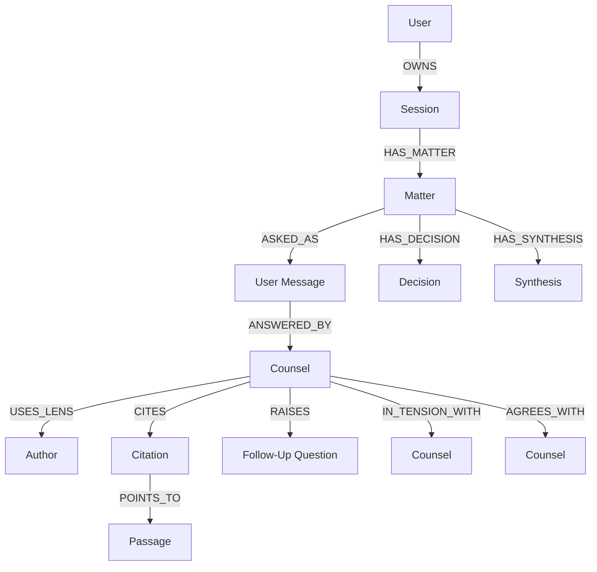

# Graph Conversation Memory Migration

**Status:** planned  
**Roadmap target:** `v1.2.3`  
**Owner surface:** PericopeAI API and Fortress Phronesis deployment control plane  
**Current source of truth:** MySQL remains canonical until a later explicit migration decision

## Purpose

PericopeAI can move conversation memory toward a graph database, but the product
goal is not to dump the user's whole transcript into every new prompt. The goal
is to make conversation continuity explicit, selective, auditable, and useful to
the counsel stack.

The graph memory layer should answer questions such as:

- What matter is this user still working through?
- Which author lenses have already given counsel on that matter?
- What citations, topics, decisions, promises, and open questions are attached?
- Which earlier matters are truly relevant to this turn?
- What context should be included in the next prompt, and what should stay out?

## Current Baseline

The deployed stack currently persists conversation and corpus state through
MySQL. The relevant existing tables include:

- `sessions`
- `messages`
- `citations`
- `session_state`
- `relationship_memory`
- `response_traces`
- `passages`
- `passage_references`
- `passage_semantic_similarity`

The current `/api/v2/chat` path already builds prompt context from recent turns,
explicit session state, relationship memory, retrieved corpus context, explicit
references, and semantic neighbors. That means a graph DB is an evolution of the
memory and retrieval layer, not a replacement for the whole chat stack.

## Core Decision

Use a staged migration:

1. Keep MySQL as the write source of truth.
2. Add a graph-shaped memory model and backfill it from MySQL.
3. Dual-write new turns to MySQL and a graph event/outbox path.
4. Use the graph as a bounded memory-selection read model.
5. Promote the graph only after parity, privacy, latency, and rollback gates
   pass.

Do not make the graph database the sole source of truth in the first release.

## Non-Goals

- Do not include full historical conversation transcripts in every prompt.
- Do not expose raw graph topology to normal public users.
- Do not replace the corpus vector indexes with conversation graph memory.
- Do not make graph writes a hard dependency for completing a chat response.
- Do not silently promote inferred personal facts into durable memory.
- Do not introduce a competing deployment path outside Fortress Phronesis.

## Conceptual Model

PericopeAI's product model is already graph-shaped:

- A user brings a `Matter`.
- One or more `Author` lenses produce `Counsel`.
- Counsel cites passages, surfaces topics, asks follow-up questions, and may be
  combined into `Synthesis`.
- Later turns refine the matter, accept or reject counsel, make decisions, and
  create promises or next actions.

The graph database should represent those product objects directly.



## Node Types

### `User`

Represents an authenticated user or verified lead identity.

Required properties:

- `user_id`
- `identity_type`
- `created_at`

Optional properties:

- `email_hash`
- `profile_version`

Do not store raw email as a graph property unless an explicit privacy review
approves it.

### `Session`

Represents a PericopeAI chat session.

Required properties:

- `session_id`
- `persona`
- `mode`
- `source`
- `started_at`
- `last_active_at`

### `Matter`

Represents the durable object of inquiry.

Required properties:

- `matter_id`
- `session_id`
- `matter_text`
- `status`
- `created_at`
- `updated_at`

Optional properties:

- `normalized_summary`
- `source_prompt_id`
- `clock_context_id`

### `Message`

Represents a raw user, assistant, or system message pointer.

Required properties:

- `message_id`
- `session_id`
- `role`
- `seq`
- `timestamp`

The graph should store a short summary and a pointer to MySQL. Raw message text
should remain in MySQL unless the implementation explicitly chooses otherwise.

### `Author`

Represents the selected author lens.

Required properties:

- `author_slug`
- `service_id`
- `service_version`

### `Counsel`

Represents one author response to a matter.

Required properties:

- `counsel_id`
- `message_id`
- `author_slug`
- `summary`
- `created_at`

Optional properties:

- `answer_hash`
- `prompt_version`
- `retrieval_trace_id`
- `response_trace_id`

### `Citation`

Represents a cited or inferred source reference.

Required properties:

- `citation_id`
- `message_id`
- `target_type`
- `target_value`
- `provenance`
- `confidence`

### `Passage`

Represents an indexed source passage.

Required properties:

- `passage_id`
- `author_slug`
- `work`
- `location`
- `source_edition`

The canonical passage content remains in the corpus/service data store.

### `Topic`

Represents a normalized theme or concept extracted from a matter, counsel, or
passage.

Required properties:

- `topic_id`
- `label`
- `normalization_version`

### `FollowUpQuestion`

Represents a question raised to deepen the same-author conversation.

Required properties:

- `follow_up_id`
- `question_text`
- `author_slug`
- `status`
- `created_at`

### `Decision`

Represents a user-confirmed decision or durable preference.

Required properties:

- `decision_id`
- `statement`
- `confirmed_by_user`
- `created_at`

Do not create durable decisions from inference alone.

### `Synthesis`

Represents a neutral synthesis across two or more counsel nodes.

Required properties:

- `synthesis_id`
- `matter_id`
- `common_ground`
- `tensions`
- `integrated_principle`
- `created_at`

## Edge Types

Use explicit edge types with provenance and timestamps.

| Edge | From | To | Purpose |
| --- | --- | --- | --- |
| `OWNS` | `User` | `Session` | User/session ownership |
| `HAS_MATTER` | `Session` | `Matter` | Session anchor |
| `ASKED_AS` | `Matter` | `Message` | Original or refined user prompt |
| `REFINES` | `Matter` | `Matter` | Matter evolution |
| `ANSWERED_BY` | `Message` | `Counsel` | Assistant counsel for a user prompt |
| `USES_LENS` | `Counsel` | `Author` | Author/persona attribution |
| `CITES` | `Counsel` | `Citation` | Response-source evidence |
| `POINTS_TO` | `Citation` | `Passage` | Citation target |
| `ABOUT` | `Matter` or `Counsel` | `Topic` | Topical indexing |
| `RAISES` | `Counsel` | `FollowUpQuestion` | Same-author follow-up |
| `RESOLVES` | `Message` | `FollowUpQuestion` | User answered a follow-up |
| `HAS_DECISION` | `Matter` | `Decision` | Confirmed durable decision |
| `HAS_SYNTHESIS` | `Matter` | `Synthesis` | Counsel stack integration |
| `SYNTHESIZES` | `Synthesis` | `Counsel` | Source counsel for synthesis |
| `AGREES_WITH` | `Counsel` | `Counsel` | Explicit agreement relation |
| `IN_TENSION_WITH` | `Counsel` | `Counsel` | Explicit tension relation |

Edges should carry:

- `created_at`
- `source`
- `confidence`
- `extraction_method`
- `trace_id` when available

## Prompt Assembly Contract

The graph should not return "all memory." It should return a bounded context
bundle.

Candidate response shape:

```json
{
  "matter": {
    "matter_id": "uuid",
    "summary": "The user's current object of inquiry."
  },
  "active_state": {
    "current_goal": "string",
    "stage": "string",
    "open_questions": ["string"],
    "next_best_action": "string"
  },
  "relevant_memory": [
    {
      "type": "prior_counsel",
      "summary": "string",
      "author_slug": "augustine",
      "reason": "same matter and unresolved follow-up"
    }
  ],
  "citation_context": [
    {
      "citation_id": "uuid",
      "target_type": "passage",
      "target_value": "Proverbs 8",
      "provenance": "retrieved"
    }
  ],
  "excluded_memory": [
    {
      "memory_id": "uuid",
      "reason": "not relevant enough for this prompt"
    }
  ]
}
```

Selection rules:

- Prefer current matter and unresolved follow-up questions.
- Prefer same-author continuity when the user remains in the same lens.
- Include cross-author counsel only when the user is stacking counsel or asking
  for synthesis.
- Include decisions only when explicitly confirmed by the user.
- Include relationship memory only when scoped to the active user and persona.
- Include citations and source references as evidence, not as hidden authority.
- Return a compact context bundle with deterministic ordering and size limits.

## Candidate Graph Database

Use an architecture decision record before choosing a graph database for
production. The default planning candidate is Neo4j because it is a mature
property graph database with Cypher query support and a large ecosystem.

Alternatives to evaluate:

- Neo4j: strongest default candidate for property graph, Cypher, tooling, and
  operations maturity.
- Kuzu: attractive for embedded/local graph workloads, but production service
  maturity and team familiarity need review.
- PostgreSQL/MySQL edge tables: useful as a first phase and as a fallback, but
  less ergonomic for multi-hop relationship queries.
- RDF/triple store: only consider if semantic-web interoperability becomes a
  primary requirement.

The graph DB decision must evaluate:

- query ergonomics
- backup and restore
- Docker Compose deployment behavior
- memory and disk requirements
- Python client support
- auth and network isolation
- observability
- rebuild speed from MySQL
- operational familiarity

## Deployment Topology If Promoted

If a graph database is promoted into the deployed stack, it must be added only
through Fortress Phronesis.

Candidate internal service:

- Service name: `pericopeai-graph`
- Network: `fortress-phronesis-net`
- Public exposure: none
- API access: only `pericopeai-api`
- Persistence: named graph volume plus rebuild path from MySQL
- Backup: graph snapshot plus MySQL canonical backup

Candidate environment variables:

- `GRAPH_MEMORY_ENABLED=false`
- `GRAPH_MEMORY_PROVIDER=neo4j`
- `GRAPH_MEMORY_URI=bolt://pericopeai-graph:7687`
- `GRAPH_MEMORY_DATABASE=pericope`
- `GRAPH_MEMORY_QUERY_TIMEOUT_MS=750`
- `GRAPH_MEMORY_WRITE_TIMEOUT_MS=1000`
- `GRAPH_MEMORY_MAX_CONTEXT_ITEMS=12`
- `GRAPH_MEMORY_MAX_CONTEXT_CHARS=4000`
- `GRAPH_MEMORY_FAIL_OPEN=true`

No public host port should be added without an explicit deployment change
request and matching lock/doc updates.

## Migration Phases

### Phase A: Relational Graph Shape

Goal: validate the product model before adding a graph DB.

Deliverables:

- Define `matter`, `counsel`, `follow_up_question`, `decision`, and
  `synthesis` persistence in MySQL or a graph-ready relational schema.
- Add stable IDs for these objects.
- Store edge-like relations in relational tables.
- Build a deterministic context selector over the relational model.
- Add reset/inspection endpoints for user-visible memory boundaries.

Exit criteria:

- Context selection is useful and bounded.
- Prompts improve continuity without adding whole transcripts.
- Memory reset/disable behavior works.

### Phase B: Graph DB Proof

Goal: prove that a graph DB produces better or simpler context selection.

Deliverables:

- Add a local-only graph DB compose profile.
- Build a backfill job from MySQL to the graph.
- Add graph query fixtures for:
  - same matter over time
  - same author follow-up
  - cross-author counsel stack
  - synthesis over multiple counsels
  - relationship memory lookup
- Compare graph query results against relational selector results.

Exit criteria:

- Graph DB can be rebuilt from MySQL.
- Query results are explainable.
- Latency is acceptable under realistic session volume.
- Graph outage does not break chat.

### Phase C: Dual Write and Read Shadowing

Goal: run graph memory beside production without changing user-visible behavior.

Deliverables:

- Add a MySQL-backed graph event/outbox table.
- Write graph events after normal MySQL chat persistence.
- Process graph events asynchronously.
- Shadow graph read results and log comparison metrics without using them in
  prompts by default.
- Add divergence reporting.

Exit criteria:

- Event backlog drains reliably.
- Graph and MySQL selectors agree on critical context.
- No sensitive raw prompts are written into logs.
- Rebuild and replay procedures are documented.

### Phase D: Bounded Graph Context in Prompt Assembly

Goal: use graph-selected memory for a small cohort or operator-enabled flag.

Deliverables:

- Add `GRAPH_MEMORY_ENABLED` gated prompt context selection.
- Keep fallback to MySQL session state and recent turns.
- Add trace fields showing which graph nodes/edges were selected.
- Add admin inspection of selected memory with reasons.

Exit criteria:

- Responses are more coherent on resumed matters.
- Same-author follow-up improves without turning into unrelated counsel.
- Token budget stays bounded.
- Prompt/context traces remain auditable.

### Phase E: Promotion Decision

Goal: decide whether the graph is a read model or a canonical store.

Default outcome should remain "derived read model" unless there is a strong
reason to change.

Promotion to canonical store requires:

- explicit user approval
- full backup/restore proof
- data deletion proof
- rollback proof
- architecture doc update
- deployment lock update if ports, services, volumes, or env vars change

## Backfill Strategy

Backfill should be repeatable and idempotent.

Inputs:

- `users`
- `sessions`
- `messages`
- `citations`
- `session_state`
- `relationship_memory`
- `response_traces`
- `passages`
- `passage_references`
- `passage_semantic_similarity`

Backfill order:

1. Users and sessions.
2. Messages and parent-child links.
3. Matters and current session state.
4. Counsel nodes from assistant messages.
5. Citations and passage targets.
6. Relationship memory.
7. Follow-up questions, decisions, and synthesis objects.
8. Topic and semantic-neighbor edges.

Backfill must record:

- source table
- source primary key
- source updated timestamp
- graph node ID
- graph write timestamp
- checksum/version when available

## Privacy And Memory Boundaries

Memory must remain explicit and inspectable.

Rules:

- Keep raw message text in MySQL unless the graph storage decision changes.
- Store graph summaries and pointers by default.
- Use hashed or internal identifiers for emails and other direct identifiers.
- Do not infer durable personal facts without user confirmation.
- Respect user reset and disable controls across MySQL and graph stores.
- Delete or detach graph nodes when the canonical MySQL record is deleted.
- Keep normal users away from raw graph topology.
- Log graph context selection reasons without logging sensitive prompt bodies.

## API Surface

Initial API surfaces should be internal or authenticated operator-only.

Candidate internal calls:

- `POST /api/internal/graph-memory/backfill`
- `POST /api/internal/graph-memory/replay-outbox`
- `GET /api/internal/graph-memory/health`
- `GET /api/internal/graph-memory/session/{session_id}/context-preview`

Candidate user-facing controls, after privacy review:

- `GET /api/v2/sessions/{session_id}/memory`
- `DELETE /api/v2/sessions/{session_id}/memory`
- `GET /api/v2/user/memory`
- `DELETE /api/v2/user/memory`

Any public or user-facing memory endpoint must enforce authentication,
ownership, scope limits, and redaction.

## Observability

Required metrics:

- graph write success/failure count
- graph outbox backlog size
- graph selector latency
- selected node/edge count per request
- selected context character count
- graph fallback count
- graph/MySQL divergence count
- memory reset/delete success count

Required trace fields:

- `graph_memory_enabled`
- `graph_context_selected`
- `graph_context_node_count`
- `graph_context_edge_count`
- `graph_context_chars`
- `graph_context_fallback_reason`
- `graph_context_selector_version`

## Testing

Required tests:

- schema mapping tests from MySQL rows to graph nodes/edges
- idempotent backfill tests
- outbox replay tests
- graph down fallback tests
- selector determinism tests
- context size limit tests
- memory reset/delete tests
- auth/ownership tests for inspection endpoints
- prompt regression tests for same-author follow-up
- counsel-stack tests for cross-author synthesis
- privacy tests proving raw prompts and direct identifiers are not leaked into
  graph logs or public endpoints

Required smoke checks:

- direct API chat with graph disabled
- direct API chat with graph enabled
- resumed session with graph enabled
- synthesis over two prior counsels
- graph service unavailable fallback
- graph rebuild from MySQL sample

## Failure Modes

Graph DB unavailable:

- Chat continues with MySQL session state, recent turns, corpus retrieval, and
  relationship memory.
- API logs `graph_context_fallback_reason=unavailable`.
- Outbox continues accumulating graph events if configured.

Graph stale:

- Selector should ignore graph data older than the canonical MySQL session
  state when freshness checks fail.
- Divergence is reported for operator review.

Graph corrupt:

- Disable graph memory flag.
- Drop/rebuild graph from MySQL canonical state.
- Re-run parity checks before re-enabling.

Graph context too large:

- Truncate by deterministic ranking.
- Preserve current matter, open questions, and selected citations first.
- Log the truncation count.

## Acceptance Criteria

The migration is successful only when:

- MySQL remains recoverable as the canonical store.
- Graph memory can be fully rebuilt from canonical data.
- Prompt assembly receives a bounded, explainable context bundle.
- Normal chat works when graph memory is disabled or unavailable.
- Users can inspect and clear durable memory.
- Raw graph internals are not exposed to normal users.
- Same-author follow-up and resumed matters improve measurably.
- Latency and token budget stay within production limits.
- Deployment docs and locks match any new service, env var, volume, or port.

## Open Questions

- Which graph database should be selected after Phase B?
- Should topic extraction be deterministic, model-assisted, or hybrid?
- What is the maximum context budget for graph-selected memory?
- Should graph memory be per-persona, cross-persona by matter, or both?
- How should family/group subscriptions affect shared memory boundaries?
- What retention policy applies to graph-derived summaries after raw message
  deletion?
